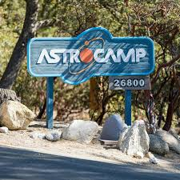
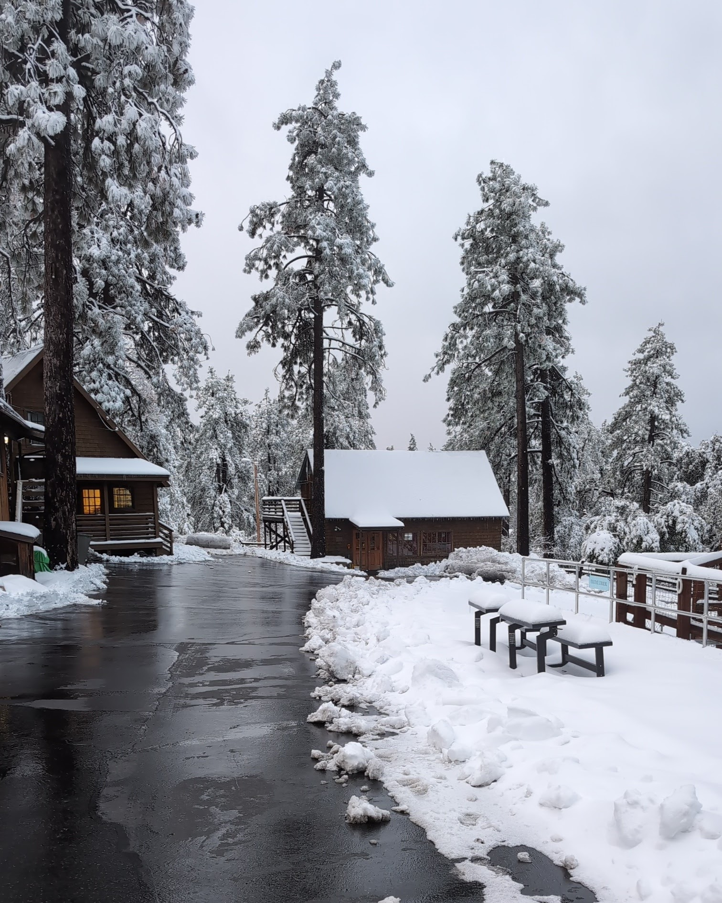
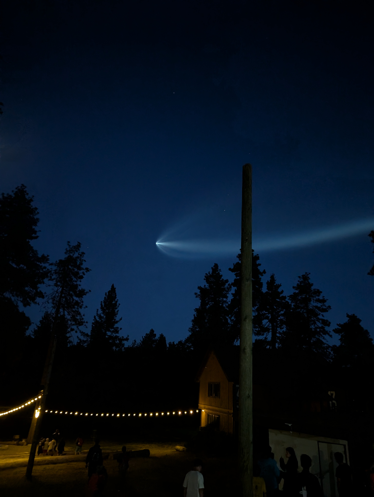

# Outreach

{align="left":} From January to July of 2024 I worked at [Astrocamp](https://astrocamp.org/) in southern California. At 5500ft above sea level in the San Jacinto Mountains, Astrocamp is located in the small town of Idyllwild. Astrocamp's goal is to provide students with suplemental science education with a focus on experiments that schools attending do not have the equipment/funding to provide. 

I worked as an instructor, where my job was to bring physical sciences and astronomy concepts to life through hands-on, experiential education classes and activities as well as lead outdoor activities and team building initiatives. Children (4-12th Grade) come with their school grade level for a 3-5 day outdoor education program. From classes like Elecricity and Magnetism, Atmospheres and Gasses, Lights and Lasers to outdoor activites such as ziplines, rock climbing, and hiking, Astrocamp is a great place to get a taste of nature while absorbing new exciting science.

I enjoyed my time there and heard from both the students and the teachers/chaperones about the impact I had made on their enthusiasm for science. I've had more than one student say that science was now their favorite subject, and how they wanted to pursue science as they get older. 

(PLACEHOLDER: insert pics of notes I have from kids when I can get to them)

## Here are some of my favorite pictures:

The week I arrived we got snowed in!

{style="height:675px;width:540px"}

I saw my first rocket launch at at Astrocamp!

{style="height:675px;width:540px"}

The veiw of the mountain from the top of the zipline tower was my favorite.

{style="height:675px;width:540px"}

