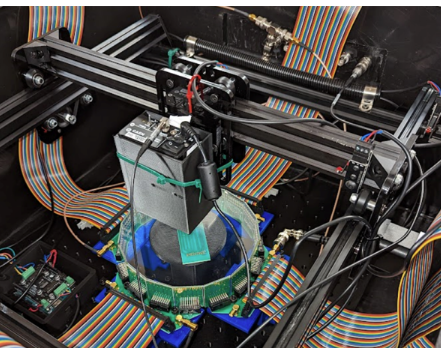

# Undergraduate Thesis Paper

Here is a brief summary of my paper which is published [here](https://dc.etsu.edu/honors/809/). 

The UCNA Experiment at the Los Alamos Neutron Science Center (LANSCE) uses an electron spectrometer to observe angular correlations between the neutron spin and the momenta of beta particles emitted during the process of beta (β) decay. Combined with neutron lifetime measurements, these observations probe physics beyond the standard model. In recent years there has been an effort to modernize the equipment to reduce the physical limitations of the experiment. The new prototype helps to reduce error via use of silicon photo-multipliers (SiPMs) and the SiPMs also have a greater quantum efficiency than the photomultiplier tubes (PMTs). However, there is still potential for error due to back-scatter, where an electron hits the scintillator and bounces off, but gets sent back into the scintillator by the magnetic field. Also when the SiPMs are activated they have a spike in voltage which exponentially decays. If 2 electrons hit within approximately 20 nanoseconds, there will be no new spike in voltage which results in a pileup in the data. My work has focused on how to recognize when pileup and or back-scatter occurs, and how to further reduce the error in this process.

This is a photo of the prototype detector in the testing appartatus:

